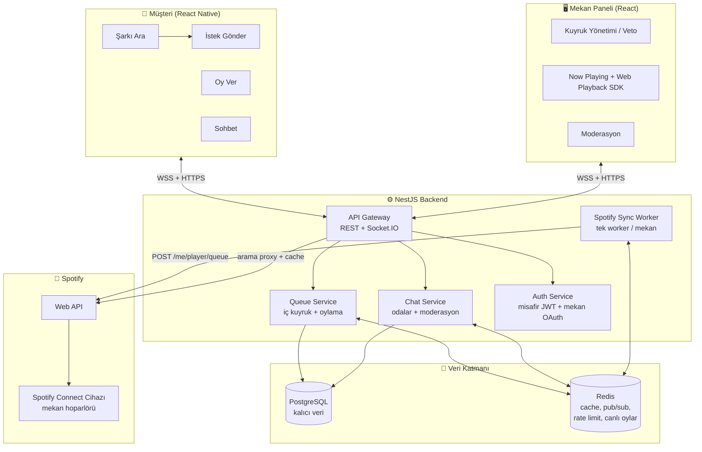
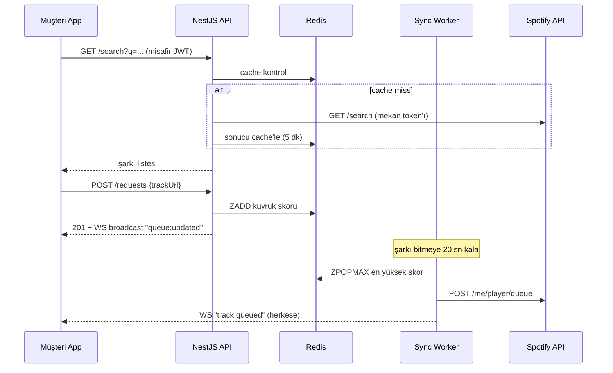

# Sistem Mimarisi

## 1. Genel Bakış

Temel tasarım kararı: **Müşteriler Spotify'a hiç dokunmaz.** Sadece mekanın Spotify hesabı backend'e bağlıdır. Müşteri istekleri bizim iç kuyruğumuzda toplanır, oylanır ve tek bir worker en çok oy alanı Spotify kuyruğuna iter. Bu sayede Şubat 2026 "5 kullanıcı" limiti sadece mekan hesaplarını sayar.

## 2. Bileşenler

### 2.1 API Gateway (NestJS)
- REST: arama, istek oluşturma, oturum yönetimi
- Socket.IO Gateway: kuyruk güncellemeleri, oy sayaçları, sohbet — Redis adapter ile yatay ölçek
- Guard'lar: misafir JWT, mekan-admin JWT, rate limit (Redis token bucket)

### 2.2 Misafir Kimliği (Spotify'sız)
1. Müşteri masadaki QR'ı okutur → `venueId` + `tableId` içeren deep link uygulamayı açar
2. Backend anonim misafir oturumu üretir (takma ad + kısa ömürlü JWT, cihaz kimliğiyle bağlı)
3. Tüm istek/oy/sohbet bu misafir kimliğiyle yapılır

### 2.3 Queue Service (iç kuyruk + oylama)
- İstekler `track_requests` tablosuna yazılır; canlı oy sayaçları Redis sorted set'te (`ZINCRBY`)
- Kurallar: kişi başı aktif istek limiti, aynı şarkı tekrar penceresi (ör. 90 dk), mekan kara listesi, explicit filtresi
- Oylama: 👍 (isteğe bağlı 👎), skor = oy + zaman bonusu (starvation önleme)

### 2.4 Spotify Sync Worker
- Mekan başına tek worker (BullMQ job): çalan şarkı bitmeye ~X sn kala en yüksek skorlu isteği `POST /me/player/queue` ile ekler
- Token yenileme, 429 backoff, cihaz düşmesi tespiti (devices polling) burada
- Spotify'a yazan **tek** bileşen → rate limit ve tutarlılık kontrolü tek noktada

### 2.5 Chat Service
- Odalar: `venue:{id}:general`, `venue:{id}:table:{n}`
- Redis pub/sub ile fan-out, mesajlar PostgreSQL'de (TTL/temizlik politikası)
- Moderasyon: küfür filtresi (TR+EN kelime listesi), kullanıcı raporlama, mekan panelinden susturma/engelleme, mesaj hızı limiti

### 2.6 Mekan Paneli
- Spotify OAuth bağlama akışı (bir kere)
- Kuyruk görüntüleme, veto, öne alma; sohbet moderasyonu; QR kod üretimi
- İsteğe bağlı: Web Playback SDK ile panelin kendisi çalar cihaz olur

## 3. Kritik Akış — Şarkı İsteği

## 4. Ölçekleme ve Dayanıklılık

- Stateless API pod'ları + Socket.IO Redis adapter → yatay ölçek
- Spotify çağrıları mekan başına serileştirilir (BullMQ concurrency=1)
- Spotify erişilemezse: iç kuyruk çalışmaya devam eder, worker retry/backoff uygular
- Gözlemlenebilirlik: yapılandırılmış log (pino), health check, Sentry

## 5. Güvenlik

- Misafir JWT kısa ömürlü (oturum mekandan ayrılınca ölür), venue-scoped
- Spotify refresh token'ları şifreli saklanır (at-rest encryption)
- CORS, helmet, giriş doğrulama (class-validator), WS handshake doğrulaması
- Kişisel veri minimum: misafirlerden e-posta/telefon istenmez (KVKK dostu)
